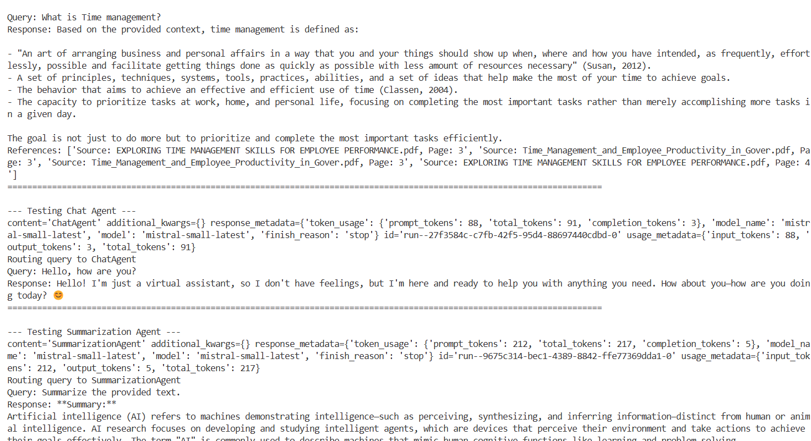

# 🧠 Multi-Agent System for PDF Ingestion and Interaction

This project implements a robust multi-agent AI system designed to ingest, process, and interact with PDF documents. It enables users to query, summarize, and engage in dialogue with AI agents based on ingested PDF content.



---

## 🚀 Key Components

### 1. 📥 PDF Ingestion Pipeline

- **Purpose**: Loads PDF files from an Azure Blob Storage container, chunks the content, generates embeddings, and stores them for retrieval.
- **Technologies**:
  - Dockerized workers  
  - Docker Swarm for orchestration  
  - Redis for job queuing and status tracking
- **Output Format**: Stored chunks include:
  - `text`
  - `source`
  - `page_number`
  - `chunk_id`
  - `timestamp`

---

### 2. 🧠 Multi-Agent AI System

- **Purpose**: Enables interaction with intelligent agents, each with a specialized role.
- **Framework**: Built with [LangChain](https://www.langchain.com/)

#### Agents Included:

- **🔍 RAGAgent**  
  Answers questions by retrieving relevant PDF content, providing references such as PDF name and page number.

- **💬 ChatAgent**  
  Handles open-ended, general conversation.

- **📝 SummarizationAgent**  
  Summarizes provided text content.

- **🧭 SupervisorAgent**  
  Acts as a smart router, analyzing user intent and delegating queries to the most suitable agent using an LLM.

---

## ⚙️ Setup & Usage

### 1. ✅ Prerequisites

Ensure you have the following installed:

- Python 3.x  
- Docker  
- Redis  
- MistralAI API Key

---

### 2. 🛠️ Build Docker Images

```bash
docker build -t <username>/base-tower-agent -f docker/Dockerfile.base .
docker build -t <username>/seeder:latest -f docker/seeder.Dockerfile .
docker build -t <username>/worker:latest -f docker/worker.Dockerfile .
```

### 3. 🔐 Set API Key

Set your **Mistral API Key** as an environment variable:

```bash
export MISTRAL_API_KEY=your_api_key_here
```

### 4. ▶️ Run the Multi-Agent System

Execute the main Python script to launch the multi-agent system